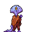

# Summary
As part of my computer science and game development studies I am making a prototype for a pokemon LIKE battler.
The code will be written in rust using the macroquad framework.

_Note: This is a prototype and does not intend to be a full featured game._

# Scope
List of things I will need to implement for the prototype to be considered "complete":
- [ ] Atleast one playable level/area.
- [ ] World triggers (i.e battles, item pickup, etc)
- [ ] Battle system with different types
- [ ] Basic animations and tiles
- [ ] Save System

# Resources
## Assets
Assets in this project are either made by myself or are freely distributed. Sprites and tiles will be 64x64 pixels. Currently I am using a fan made sprite sheet of William from Eastward as the player sprite. I will eventually make my own sprites but right now I'm focusing on the programming and design aspects of the prototype.

## Some of the current art:

_This is the first asset I made myself for the game so that's cool I guess_

